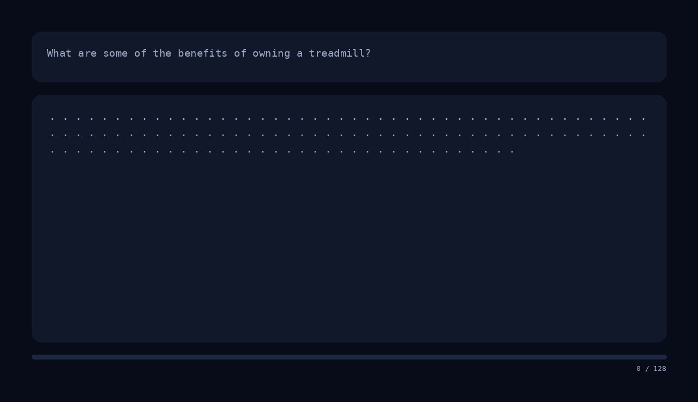
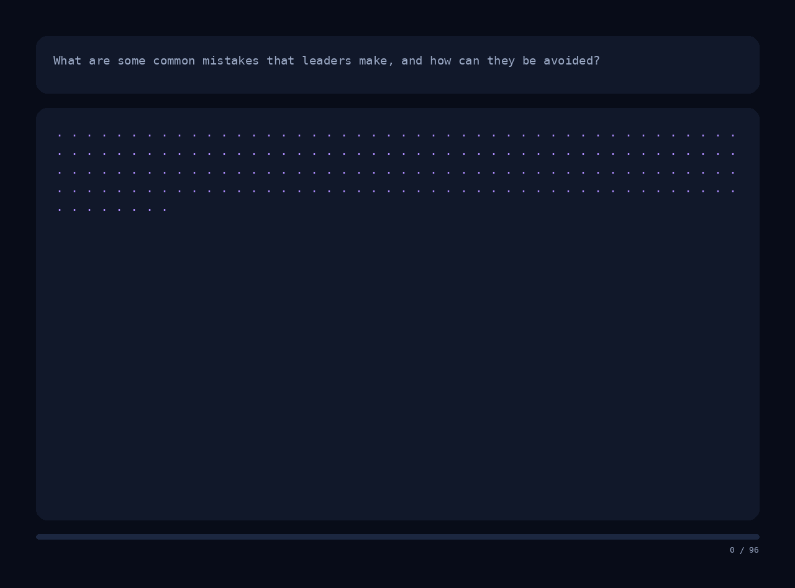

# DiffusionLLM

[](https://github.com/lamm-mit/DiffusionLLM/actions/workflows/ci.yml)
[](LICENSE)
[](pyproject.toml)

A codebase for converting a small decoder-only
autoregressive language model into a masked diffusion language model (MDLM),
training it, and generating text by iterative denoising.

> Conversion is only an initialization. Removing the causal mask preserves
> useful AR weights, but the resulting checkpoint must be trained with the
> diffusion objective before it becomes a useful diffusion generator.

## What is included

- AR-to-diffusion conversion for Qwen2/Qwen2.5, Qwen3, and Llama models (others can be added).
- Padding-aware bidirectional attention with the original pretrained weights.
- Continuous-time absorbing-mask MDLM training.
- Raw-text continual pretraining and supervised fine-tuning.
- Full-parameter and LoRA training.
- Parallel and blockwise iterative denoising.
- Chat-template-aware SFT and inference.
- Reproducible held-out generation evaluation with JSONL records and summaries.
- Animated GIF export of the complete denoising trajectory.
- Optional automatic model and checkpoint uploads to the Hugging Face Hub.
- Manifest-driven, exact-size chat-mixture construction with recoverable uploads.
- Local files, saved `datasets` directories, and Hugging Face Hub datasets.
- Offline unit tests, attention tests, and an end-to-end training test.



## Installation

Python 3.10+ is required. A CUDA GPU is strongly recommended for real models.

### Recommended: uv

```bash
curl -LsSf https://astral.sh/uv/install.sh | sh
source "$HOME/.local/bin/env"

git clone https://github.com/lamm-mit/DiffusionLLM.git
cd DiffusionLLM

uv sync --python 3.12
uv run diffusion-llm doctor
```

`uv sync` creates `.venv` and installs the project. Commands below use
`uv run`, so manual activation is unnecessary.

For a complete production-style walkthrough—including a reproducible
2,000,000-example chat mixture, 1,024-token continuation training, checkpoint
resume and Hub upload, dual-GPU testing, system prompts, and denoising GIFs—see
the **[end-to-end training recipes](TRAINING.md)**.

For development:

```bash
uv sync --extra dev
CUDA_VISIBLE_DEVICES="" uv run pytest
uv run ruff check .
```

The test suite uses tiny models and should normally run on CPU. Hiding CUDA
prevents Transformers from automatically wrapping the end-to-end test in
multi-GPU `DataParallel`.

### Compatible alternative: venv and pip

```bash
git clone https://github.com/lamm-mit/DiffusionLLM.git
cd DiffusionLLM

python3 -m venv .venv
source .venv/bin/activate
python -m pip install --upgrade pip
python -m pip install -e .
diffusion-llm doctor
```

The package targets `transformers>=5.13,<6`. Its attention implementation is
version-sensitive.

On a minimal Ubuntu GPU host, install a compiler and the development headers
matching the Python used by the environment. For the Python 3.12 setup above:

```bash
sudo apt-get update
sudo apt-get install -y build-essential python3.12-dev
```

If the host uses another Python version, install the matching
`pythonX.Y-dev` package.

## Build a configurable training mixture

Dataset sources live in an editable JSON manifest. The included
[`examples/chatmix_2m.json`](examples/chatmix_2m.json) uses UltraChat and four
Apache-2.0 SmolTalk subsets as its fixed core, then samples Dolci-No-Tools to
reach the requested total exactly:

```bash
uv run hf auth login

uv run diffusion-llm build-mixture \
  --manifest examples/chatmix_2m.json \
  --target-train-rows 2000000 \
  --save-to-disk artifacts/diffusion-chat-mixture-1024-chatmix-2m \
  --push-to-hub \
  --hub-dataset-id lamm-mit/diffusion-chat-mixture-1024 \
  --hub-config-name chatmix_2m \
  --num-proc 16 \
  --upload-num-proc 1
```

Filtering and normalization may use many workers, but Hub upload defaults to
one process. This avoids Python multiprocessing failures when a parent process
has no importable script path. The CLI saves the complete local `DatasetDict`
before uploading, so a network failure does not require rebuilding it.

Retry only the upload with:

```bash
uv run diffusion-llm upload-mixture \
  --dataset artifacts/diffusion-chat-mixture-1024-chatmix-2m \
  --hub-dataset-id lamm-mit/diffusion-chat-mixture-1024 \
  --hub-config-name chatmix_2m \
  --num-proc 1
```

Edit the manifest to add or remove sources, change splits and licenses, cap a
source with `max_train_rows`, or choose one source with `fill: true` to supply
the exact remainder. `validation_split: null` reserves disjoint validation
rows from that source's training split. See the
**[end-to-end training recipes](TRAINING.md#2-build-and-publish-the-2m-example-mixture)**
for the manifest schema, retry instructions, and the subsequent training run.

## Small end-to-end example

This converts Qwen2.5-0.5B-Instruct, runs a short LoRA SFT job, generates one
answer, and records the denoising process. It demonstrates the pipeline; it is
not intended to produce a strong checkpoint.

### 1. Convert the AR checkpoint

```bash
uv run diffusion-llm convert \
  --source Qwen/Qwen2.5-0.5B-Instruct \
  --output artifacts/qwen2.5-0.5b-diffusion-base \
  --dtype bfloat16
```

This command:

1. loads the AR model and tokenizer;
2. adds `<|diffusion_mask|>` and resizes the embeddings when necessary;
3. replaces causal attention with padding-aware bidirectional attention;
4. retains the pretrained weights and parameter names; and
5. saves a self-contained diffusion initialization.

Inspect it:

```bash
uv run diffusion-llm doctor \
  --model artifacts/qwen2.5-0.5b-diffusion-base
```

### 2. Run a short SFT smoke test

```bash
uv run diffusion-llm train \
  --model artifacts/qwen2.5-0.5b-diffusion-base \
  --dataset tatsu-lab/alpaca \
  --mode sft \
  --output artifacts/qwen2.5-0.5b-diffusion-smoke \
  --max-length 256 \
  --max-train-samples 5000 \
  --max-eval-samples 250 \
  --max-steps 250 \
  --batch-size 1 \
  --gradient-accumulation-steps 8 \
  --learning-rate 1e-4 \
  --lora \
  --gradient-checkpointing \
  --bf16
```

The SFT loader automatically applies the tokenizer chat template to
`messages`, `instruction/output`, and `prompt/response` records. Prompt tokens
remain visible as context but use label `-100`, so they are neither corrupted
nor included in the loss.

### 3. Generate and create a GIF

```bash
uv run diffusion-llm generate \
  --model artifacts/qwen2.5-0.5b-diffusion-smoke \
  --prompt "Explain masked diffusion in one concise paragraph." \
  --system-prompt "Answer clearly and accurately." \
  --chat-template \
  --max-new-tokens 64 \
  --steps 24 \
  --block-size 64 \
  --temperature 0.2 \
  --gif artifacts/denoising.gif \
  --gif-frame-duration-ms 180
```

`--system-prompt` is optional and requires `--chat-template`. When supplied,
generation applies the tokenizer chat template to a `system` message followed
by the user `--prompt`, matching SFT datasets that use separate system and user
roles.

The animation contains only two clean text panels: the prompt and the evolving
result. Unresolved tokens appear as purple dots, newly committed text appears
in gold, and older committed text becomes white. A small progress bar and step
counter show the trajectory. The initial and final frames pause automatically.

Generation and interactive chat show a terminal `tqdm` bar over the actual
denoising forward passes by default. Pass `--no-progress` for quiet scripts or
logs. The bar is written to stderr, so `generate --json` keeps stdout
machine-readable.

For the clearest parallel-denoising demonstration, make `--block-size` equal to
`--max-new-tokens`. GIF history is collected only when `--gif` is supplied.
The renderer is tested with a long prompt and a 128-token result; the canvas
grows with wrapped output up to 24 result lines.

## Substantial training recipe

The command below is the original UltraChat baseline. For the larger next-stage
run, use **[the complete 2M-example, 1,024-token recipe](TRAINING.md)**. It
starts from the published UltraChat diffusion model, broadens the instruction
mixture, uses one deliberate epoch at a lower learning rate, uploads each
checkpoint update to the Hub repository root, and tests generation on a second
GPU.

For materially better results, use a stronger instruction-tuned
initialization, high-quality conversational data, full-model training, and
enough steps for every attention layer to adapt to bidirectional denoising.

This baseline uses:

- [`Qwen/Qwen2.5-1.5B-Instruct`](https://huggingface.co/Qwen/Qwen2.5-1.5B-Instruct);
- the 207k-conversation `train_sft` split of
  [`HuggingFaceH4/ultrachat_200k`](https://huggingface.co/datasets/HuggingFaceH4/ultrachat_200k);
- three epochs at sequence length 512;
- effective batch size 64 on one RTX 6000 Ada; and
- full-parameter training rather than LoRA.

Convert the larger initialization:

```bash
uv run diffusion-llm convert \
  --source Qwen/Qwen2.5-1.5B-Instruct \
  --output artifacts/qwen2.5-1.5b-diffusion-base \
  --dtype bfloat16
```

On a machine with multiple GPUs you can isolate training to one of the GPUs and use the other for inference/testing and benchmarking while training:

```bash
CUDA_DEVICE_ORDER=PCI_BUS_ID \
CUDA_VISIBLE_DEVICES=1 \
uv run diffusion-llm train \
  --model artifacts/qwen2.5-1.5b-diffusion-base \
  --dataset HuggingFaceH4/ultrachat_200k \
  --train-split train_sft \
  --eval-split test_sft \
  --mode sft \
  --output artifacts/qwen2.5-1.5b-diffusion-ultrachat \
  --max-length 512 \
  --epochs 3 \
  --batch-size 2 \
  --eval-batch-size 2 \
  --gradient-accumulation-steps 32 \
  --learning-rate 5e-5 \
  --warmup-steps 0.03 \
  --weight-decay 0.1 \
  --max-eval-samples 2000 \
  --logging-steps 10 \
  --save-steps 500 \
  --eval-steps 500 \
  --save-total-limit 3 \
  --num-proc 16 \
  --gradient-checkpointing \
  --bf16
```

Per-device batch 2 and gradient accumulation 32 give an effective batch of
`2 × 32 = 64`. The complete run is roughly 9,700 optimizer steps before
filtering or truncation effects. If memory is tight, use batch 1 and gradient
accumulation 64.

Inside this process, the physical RTX 6000 Ada is intentionally renumbered to
`cuda:0`. Only one GPU is visible, so Transformers does not activate
`DataParallel`.

In a second terminal, sample a completed numbered checkpoint on a second physical GPU 0:

```bash
CUDA_DEVICE_ORDER=PCI_BUS_ID \
CUDA_VISIBLE_DEVICES=0 \
uv run diffusion-llm generate \
  --model artifacts/qwen2.5-1.5b-diffusion-ultrachat/checkpoint-500 \
  --prompt "Explain how masked diffusion generates text in parallel and compare it with autoregressive decoding." \
  --chat-template \
  --max-new-tokens 128 \
  --steps 48 \
  --block-size 128 \
  --temperature 0.2 \
  --device cuda:0 \
  --gif artifacts/ultrachat-denoising.gif \
  --gif-frame-duration-ms 140
```

## Evaluate held-out generations

Training reports held-out diffusion loss when `--eval-split` is set. Use the
`evaluate` command to complement that loss with generated answers from a fixed,
shuffled sample of the held-out split:

```bash
MODEL=artifacts/qwen2.5-1.5b-diffusion-chatmix-1024-2m-from-base/checkpoint-4400

CUDA_DEVICE_ORDER=PCI_BUS_ID \
CUDA_VISIBLE_DEVICES=0 \
uv run --no-sync diffusion-llm evaluate \
  --model "$MODEL" \
  --dataset lamm-mit/diffusion-chat-mixture-1024 \
  --dataset-config chatmix_2m \
  --split validation \
  --num-samples 32 \
  --batch-size 2 \
  --max-total-tokens 1024 \
  --max-new-tokens 512 \
  --steps 512 \
  --block-size 8 \
  --temperature 0 \
  --dtype bfloat16 \
  --device cuda:0 \
  --output artifacts/checkpoint-4400-heldout.jsonl
```

Rows must use `messages`, `instruction`/`output`, or
`prompt`/`response`/`completion`. Preformatted `text` rows cannot be separated
into prompt and reference and are skipped. For chat data, the final assistant
message becomes the reference and all preceding messages become the prompt.
This preserves system messages and multi-turn context. The same chat formatting
path is used by SFT preprocessing and evaluation.

The detailed JSONL stores prompts, references, generations, token counts,
source labels, exact match, and lexical token F1. A sibling
`checkpoint-4400-heldout.summary.json` contains aggregate and per-source
statistics plus counts of unsupported or over-length rows. Pass
`--summary-output PATH` to choose another summary location or `--overwrite` to
replace existing results.

For checkpoint comparisons, keep the dataset, split, seed, length settings,
and decoding settings fixed. `--temperature 0` makes low-confidence decoding
deterministic. Lexical F1 measures surface overlap only; open-ended chat quality
should be assessed by inspecting the saved generations or with a blinded human
or LLM judge.

## Weights & Biases experiment tracking

W&B is optional and training remains offline by default. Install and
authenticate it once on a standard installation:

```bash
uv sync --extra tracking
uv run wandb login
```

On a DGX Spark installation whose CUDA PyTorch wheel must remain untouched:

```bash
uv pip install wandb
uv run --no-sync wandb login
```

Enable reporting by replacing `--report-to none` with:

```bash
  --report-to wandb \
  --wandb-project DiffusionLLM \
  --run-name qwen2.5-1.5b-chatmix-1024
```

`DiffusionLLM` is the default W&B project, so `--wandb-project` may be omitted.
Without `--run-name`, the output directory's basename becomes the run name.
Use `--wandb-entity` for a user or team namespace. Existing `WANDB_PROJECT` and
`WANDB_ENTITY` environment variables take precedence over CLI defaults.

Transformers automatically reports training/evaluation loss, learning rate,
gradient norm, epoch, and global step. W&B model artifact upload remains off by
default because this project already supports Hugging Face Hub checkpoints; set
`WANDB_LOG_MODEL=end` or `checkpoint` explicitly if both are desired.

## Push models to the Hugging Face Hub

Authenticate once with a write-capable Hugging Face token:

```bash
uv run hf auth login
```

### Push automatically during training

Add these arguments to any `diffusion-llm train` command:

```bash
  --push-to-hub \
  --hub-model-id lamm-mit/qwen2.5-1.5b-diffusion-ultrachat \
  --hub-strategy every_save
```

`every_save` asynchronously updates the model at the repository root whenever
`--save-steps` triggers, then performs a blocking final upload. Use
`--hub-strategy end` to upload only the final model, `checkpoint` to also keep
the latest resumable state under `last-checkpoint`, or `all_checkpoints` to
retain every numbered checkpoint. Add `--hub-private` when creating a private
repository. Privacy cannot be changed by the flag after a repository exists.

For example, the end of the substantial training command can be:

```bash
  --gradient-checkpointing \
  --bf16 \
  --push-to-hub \
  --hub-model-id lamm-mit/qwen2.5-1.5b-diffusion-ultrachat \
  --hub-strategy every_save
```

### Push an existing checkpoint manually

Upload a completed numbered checkpoint to the root of a model repository:

```bash
uv run hf upload \
  lamm-mit/qwen2.5-1.5b-diffusion-ultrachat \
  artifacts/qwen2.5-1.5b-diffusion-ultrachat/checkpoint-500 \
  . \
  --exclude "*.pt" \
  --exclude "*.pth" \
  --commit-message "Upload diffusion checkpoint 500"
```

Add `--private` to that command if the repository does not exist yet and
should be private. Do not upload a checkpoint directory while the trainer is
still writing it.

After training finishes, the output directory root contains the final model.
Upload it while excluding the large local Trainer checkpoint directories:

```bash
uv run hf upload \
  lamm-mit/qwen2.5-1.5b-diffusion-ultrachat \
  artifacts/qwen2.5-1.5b-diffusion-ultrachat \
  . \
  --exclude "checkpoint-*" \
  --commit-message "Upload final diffusion model"
```

### Generate from the automatically pushed model

When training used `--push-to-hub` and `--hub-strategy every_save`, the model
repository root contains the latest successfully uploaded model. The Hub hosts
the checkpoint files, not this inference implementation. On another machine,
install DiffusionLLM and generate directly from the model ID:

```bash
git clone https://github.com/lamm-mit/DiffusionLLM.git
cd DiffusionLLM
uv sync --python 3.12

CUDA_DEVICE_ORDER=PCI_BUS_ID \
CUDA_VISIBLE_DEVICES=0 \
uv run diffusion-llm generate \
  --model lamm-mit/qwen2.5-1.5b-diffusion-ultrachat \
  --prompt "What are some common mistakes that leaders make, and how can they be avoided?" \
  --chat-template \
  --max-new-tokens 192 \
  --steps 96 \
  --block-size 32 \
  --temperature 0.2 \
  --device cuda:0 \
  --gif artifacts/hub-leadership-denoising.gif \
  --gif-frame-duration-ms 100
```



For a private model, run `uv run hf auth login` on the inference machine as
well, or provide a read token through the `HF_TOKEN` environment variable.

## Other modes

The SFT loader accepts:

- `messages`: a list of `{role, content}` records;
- Alpaca `instruction`, optional `input`, and `output`;
- `prompt` plus `response` or `completion`; or
- `text`, treated as an already formatted sequence.

Add `--lora` for a lower-memory experiment. LoRA checkpoints record their
converted base model and can be passed directly to `generate` or `chat`.

For raw-text continual pretraining:

```bash
uv run diffusion-llm train \
  --model artifacts/qwen2.5-0.5b-diffusion-base \
  --dataset Trelis/tiny-shakespeare \
  --mode pretrain \
  --text-field Text \
  --output artifacts/qwen2.5-0.5b-diffusion-shakespeare \
  --max-length 128 \
  --max-steps 500 \
  --batch-size 4 \
  --gradient-accumulation-steps 4 \
  --learning-rate 1e-4 \
  --bf16
```

Interactive chat uses the tokenizer chat template by default:

```bash
uv run diffusion-llm chat \
  --model artifacts/qwen2.5-1.5b-diffusion-ultrachat \
  --max-new-tokens 96 \
  --steps 48 \
  --block-size 32
```

Use `/clear` to reset and `/quit` to exit. Pass `--raw-prompt` when the model
was trained without a chat template.

## Exact method

This repository implements a **continuous-time masked diffusion language model
(MDLM) with an absorbing mask state**.

### Model conversion

The converter preserves the tokenizer, token embeddings, transformer blocks,
LM head, pretrained weights, and the source model's rotary token positions. It
replaces lower-triangular causal attention with padding-aware bidirectional
attention and adds one mask token.

### Forward corruption and objective

For every sequence:

1. Sample one scalar diffusion time
   $t \sim U(\epsilon,1)$, with $\epsilon=10^{-3}$ by default.
2. Use the linear survival schedule $\alpha(t)=1-t$.
3. Independently replace each trainable token by the mask token with
   probability $1-\alpha(t)=t$.
4. Predict the clean token at the same position from the bidirectional noised
   sequence. There is no causal right shift.
5. Apply the continuous-time schedule weight
   $-\alpha'(t)/(1-\alpha(t))=1/t$ only to corrupted target positions.

```math
\mathcal{L}
=
\mathbb{E}_{t,x_t}
\left[
\frac{1}{t}
\sum_{i \in M_t}
-\log p_\theta(x_{0,i}\mid x_t)
\right].
```

### Time encoding

**The network receives no explicit diffusion-time encoding.** Time $t$ is used
by the corruption sampler and loss weighting, but is not embedded, added to
token states, or passed to the Transformer. The denoiser conditions on $x_t$
itself, particularly the locations and fraction of mask tokens.

The original Qwen/Llama rotary position embeddings remain active. They encode
token position in the sequence, not diffusion time.

### Reverse process

Generation starts with a fixed canvas of masks. At every step the network:

1. predicts all currently unresolved positions in one bidirectional pass;
2. excludes the mask and padding tokens as output candidates;
3. ranks predictions by confidence; and
4. permanently commits a scheduled number of tokens.

The process repeats until no masks remain. With
`block-size < max-new-tokens`, blocks are completed from left to right.
`--remasking random` replaces confidence ranking with random selection as an
ablation.

This is iterative absorbing-mask denoising. It is not Gaussian diffusion, does
not use a learned time embedding, and is not an exact ancestral sampler for a
general discrete transition matrix.

See [docs/method.md](docs/method.md) for the longer derivation and
[docs/classroom-lab.md](docs/classroom-lab.md) for a lab to get started locally and explore the code and associated method.

## Command reference

```text
diffusion-llm convert   AR checkpoint -> bidirectional checkpoint
diffusion-llm build-mixture  source manifest -> exact-size chat DatasetDict
diffusion-llm upload-mixture saved DatasetDict -> Hugging Face Hub
diffusion-llm train     continual pretraining or SFT
diffusion-llm generate  one-shot denoising, optionally with GIF export
diffusion-llm chat      interactive multi-turn inference
diffusion-llm doctor    dependency, device, and checkpoint inspection
```

Every subcommand provides detailed help:

```bash
uv run diffusion-llm generate --help
```

`block-size` controls generation:

- `block-size == max-new-tokens`: denoise the entire output together;
- smaller blocks: semi-autoregressive, block-by-block generation; and
- `block-size == 1`: an expensive AR-like limiting case.

`steps` is a total budget divided across blocks. Every mask is guaranteed to
resolve even when there are fewer steps than output tokens.

## Verification

```bash
CUDA_VISIBLE_DEVICES="" uv run pytest
uv run ruff check .
```

The suite checks:

- future tokens affect earlier logits;
- padding does not change real-token logits;
- converted checkpoints reload through `AutoModelForMaskedLM`;
- mask-token embedding sizes match the tokenizer;
- reveal schedules fill every mask;
- prompts remain immutable;
- long denoising histories render as valid multi-frame GIFs;
- diffusion loss is finite and differentiable; and
- custom diffusion loss is normalized correctly during gradient accumulation;
- conversion, local data, training, save, reload, and generation work together.

## Project layout

```text
DiffusionLLM/
├── src/diffusion_llm/
│   ├── cli.py           # all CLI commands
│   ├── conversion.py    # AR checkpoint conversion
│   ├── modeling.py      # bidirectional Llama/Qwen model classes
│   ├── data.py          # local and Hub datasets
│   ├── mixture.py       # configurable exact-size dataset mixtures
│   ├── training.py      # continuous-time MDLM objective
│   ├── sampling.py      # iterative unmasking
│   ├── schedule.py      # corruption and reveal schedules
│   ├── visualization.py # denoising GIF renderer
│   └── loading.py       # full-checkpoint and LoRA loading
├── tests/
├── docs/
└── examples/
```

## Scope and limitations

- Short runs do not reproduce published diffusion-LLM quality.
- Only Qwen2/Qwen2.5, Qwen3, and Llama-family decoder layouts are supported.
- Diffusion inference performs repeated full-sequence forward passes and is
  slower than optimized production kernels.
- This project intentionally excludes BD3LM, GRPO, lm-evaluation-harness,
  DeepSpeed recipes, Slurm wrappers, and architecture-specific production
  samplers.

## Attribution

The design was informed by the Apache-2.0
[`ZHZisZZ/dllm`](https://github.com/ZHZisZZ/dllm) repository, especially its
`examples/a2d` pipeline, at commit
[`ca176752`](https://github.com/ZHZisZZ/dllm/commit/ca176752fbceec49c6b4777a2c18ae88e4eb10ed).
See [docs/upstream-review.md](docs/upstream-review.md) and [NOTICE](NOTICE).

Contributions are welcome; see [CONTRIBUTING.md](CONTRIBUTING.md). This project
is distributed under the [Apache License 2.0](LICENSE).
